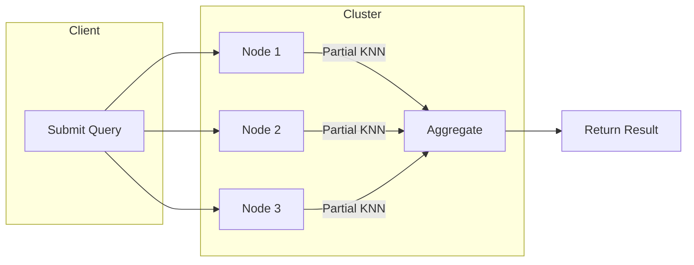

# Distributed-KNN

Distributed-KNN is a scalable implementation of the k-Nearest Neighbors (KNN) algorithm designed to run efficiently on distributed systems. This project aims to facilitate large-scale machine learning tasks by leveraging parallel computation and distributed data storage, making it suitable for big data environments.

## Table of Contents

- [Overview](#overview)
- [Features](#features)
- [Installation](#installation)
- [Usage](#usage)
- [Architecture](#architecture)
- [Configuration](#configuration)
- [Dataset Preparation](#dataset-preparation)
- [Examples](#examples)
- [Benchmarks](#benchmarks)
- [Contributing](#contributing)
- [License](#license)
- [Acknowledgements](#acknowledgements)

## Overview

KNN is a simple but powerful machine learning algorithm used for classification and regression. By operating in a distributed setting, this project enables fast, parallelized, and scalable KNN queries across large datasets.

**Key Components:**
- Distributed storage and computation
- Support for large-scale datasets
- Configurable k value and metric (e.g., Euclidean, Manhattan)
- Extensible framework for integration with other distributed platforms

## Features

- **Scalable Architecture:** Handles datasets that don't fit into memory by distributing data and computation.
- **Flexible Distance Metrics:** Supports various distance calculations (Euclidean, Manhattan, Cosine, etc.).
- **Easy Integration:** Modular design allows integration with data pipelines and cloud platforms.
- **Fault Tolerance:** Designed to operate reliably in unreliable distributed environments.
- **Visualization Tools:** Optional modules for performance and result visualization.

## Installation

### Prerequisites

- Python 3.8+
- [pip](https://pip.pypa.io/en/stable/)
- Recommended: Apache Spark, Hadoop, or other distributed frameworks (optional for non-distributed mode)

### Steps

1. Clone the repository:
    ```bash
    git clone https://github.com/ImaneElabid/Distributed-KNN.git
    cd Distributed-KNN
    ```

2. Install project dependencies:
    ```bash
    pip install -r requirements.txt
    ```

3. (Optional) Set up Spark/Hadoop cluster for distributed execution.

## Usage

Distributed-KNN can be run in standalone mode or on a distributed platform.

### Example: Local Run

```bash
python main.py --data data/dataset.csv --k 5 --distance euclidean
```

### Example: Distributed Run (with Spark)

```bash
spark-submit main.py --data hdfs://path/to/data.csv --k 3 --distance cosine
```

### Parameters

| Parameter         | Description                                       |
|-------------------|--------------------------------------------------|
| `--data`          | Path to dataset (local or HDFS)                  |
| `--k`             | Number of nearest neighbors                      |
| `--distance`      | Distance metric (`euclidean`, `manhattan`, etc.) |
| `--distributed`   | Flag to enable distributed mode                  |

## Architecture

Distributed-KNN typically includes:

- **Data Ingestion**: Reads data from local files or distributed file systems.
- **Partitioning**: Splits data across available nodes or processes.
- **Query Processing**: Parallel computation of neighbor searches.
- **Aggregation**: Collects and combines results from all nodes.

*Typical Workflow Diagram:*



## Configuration

A sample configuration file (`config.yaml`):

```yaml
data_path: "data/dataset.csv"
k: 5
distance_metric: "euclidean"
distributed: true
num_nodes: 4
```

## Dataset Preparation

- Data should be in CSV or Parquet format with features in columns.
- Label column should be the last column (for classification tasks).
- Example row: `4.2,3.5,1.4,0.2,Iris-setosa`


## Benchmarks

Sample benchmark results:

| Dataset Size | k Value | Time (s) | Speedup vs Local |
|--------------|---------|----------|------------------|
| 10K rows     | 5       | 15       | 5x               |
| 100K rows    | 5       | 60       | 7x               |
| 1M rows      | 5       | 280      | 8x               |


## License

Distributed-KNN is released under the MIT License. See [LICENSE](LICENSE) for details.

## Acknowledgements

- All contributors!
  _By iko: Imane - Karim - Ossama_

---

*For questions or support, open a GitHub issue.*


